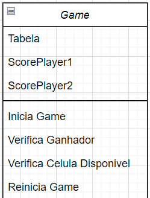
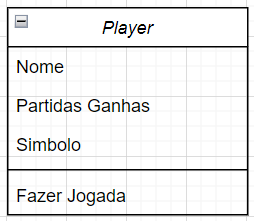
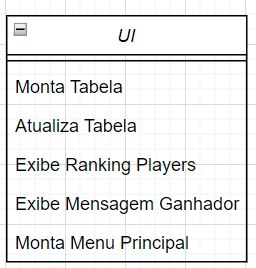
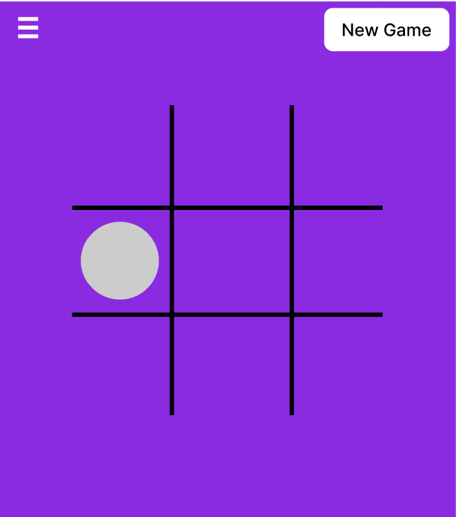
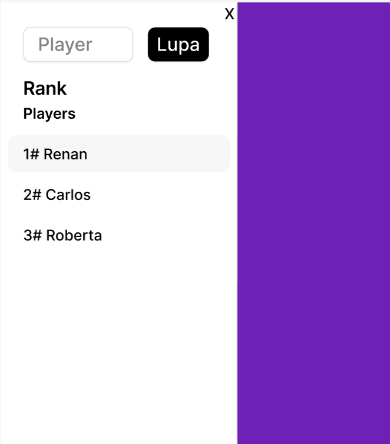
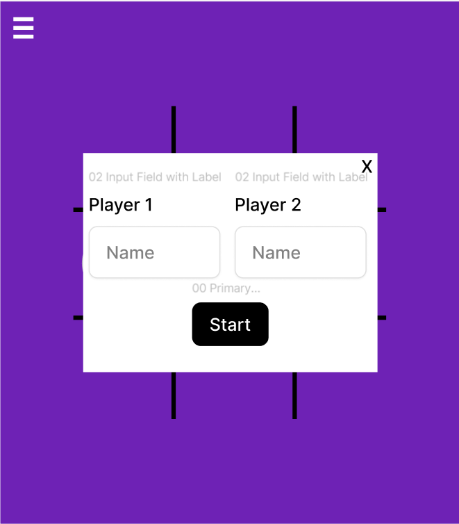
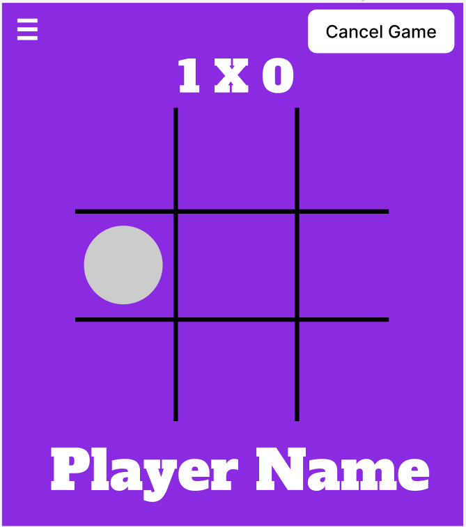
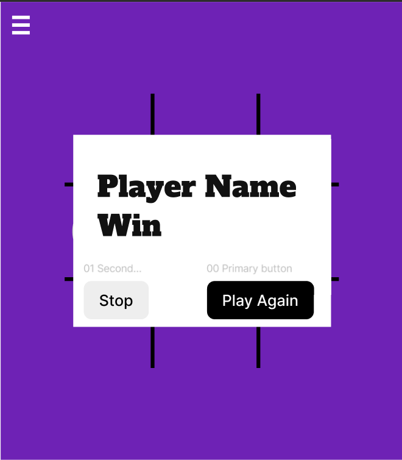

# Jogo da Velha - Trabalho de Front End

## Descrição do Projeto

O aplicativo foi desenvolvido para proporcionar ao usuário uma experiência intuitiva e de fácil acesso.

Antes de iniciar o desenvolvimento, todo o design foi elaborado na plataforma Figma. A aplicação possui apenas uma página, cujo conteúdo é dinamicamente controlado por uma classe. Abaixo estão as imagens de todas as interfaces:

## Estrutura do Projeto

Para uma melhor organização, utilizamos o paradigma de programação orientado a objetos. Cada classe foi criada em arquivos separados, facilitando a visualização e manutenção do código fonte.

### Classes Utilizadas

1. **Player**
   - Armazena o nome do jogador.
   - Define o símbolo que o jogador utilizará na rodada atual.
   - Registra a quantidade de partidas ganhas no jogo atual.

2. **Game**
   - Armazena as informações do jogo atual (tabela) e o placar dos jogadores.
   - Inicia o jogo.
   - Verifica se houve um ganhador e quem foi o vencedor.
   - Verifica as células disponíveis.
   - Reinicia o jogo.

3. **UI**
   - Monta toda a interface do usuário, incluindo o jogo em si e a tabela de ranking.

### Persistência de Dados

Todas as partidas ganhas pelos jogadores são armazenadas em memória. Assim, se o jogador retornar posteriormente, seu saldo de vitórias não será perdido. Ao final de cada partida, as vitórias são somadas em um ranking geral, onde é possível visualizar a posição de cada jogador e quem está no topo da tabela.

## Diagramas de Classes

Para organizar as classes, utilizamos o draw.io para desenhá-las. Abaixo estão as imagens de todas as classes:

## Imagens das Interfaces

Abaixo você encontrará as imagens de todas as interfaces:

---

Este README foi criado para proporcionar uma visão geral clara e organizada do projeto "Jogo da Velha". Se tiver alguma dúvida ou sugestão, sinta-se à vontade para entrar em contato.
